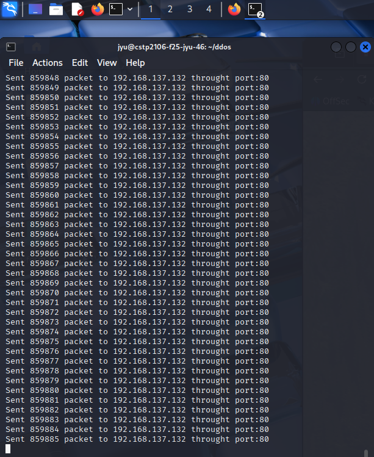
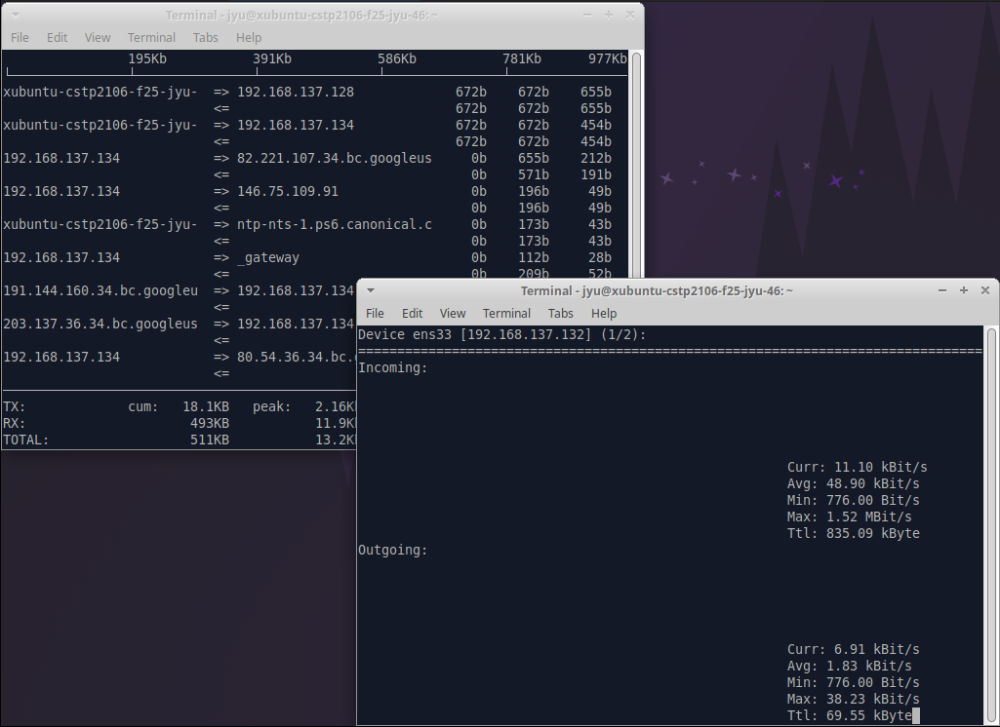
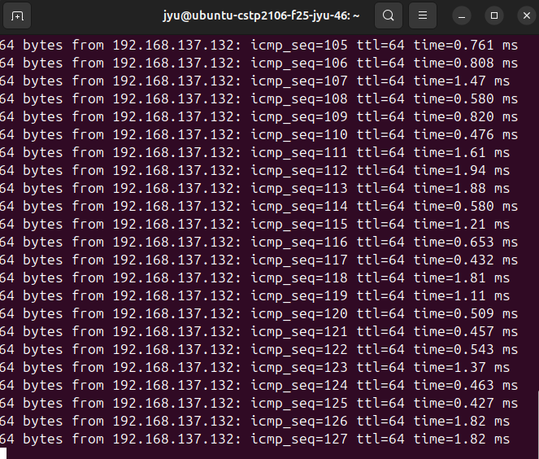
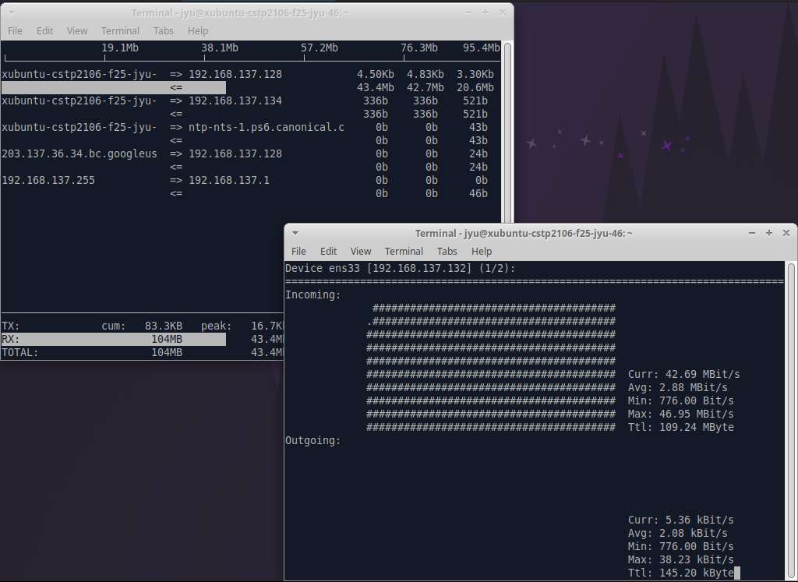
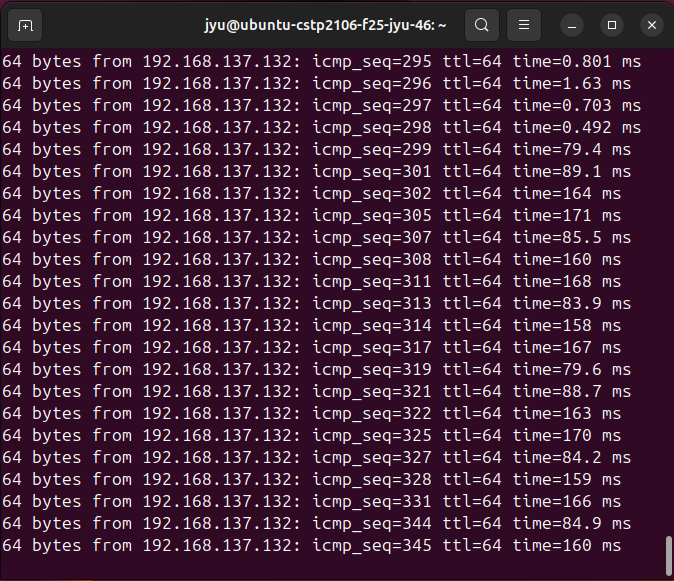
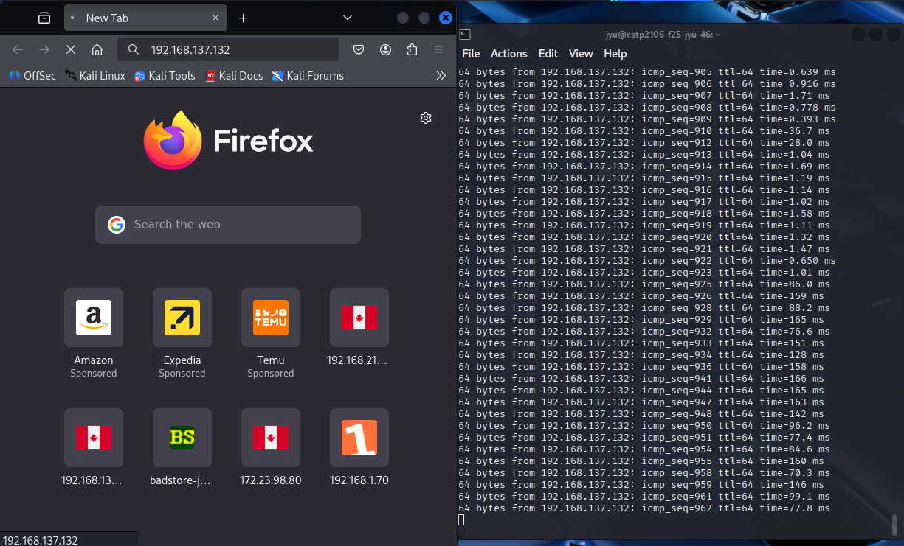
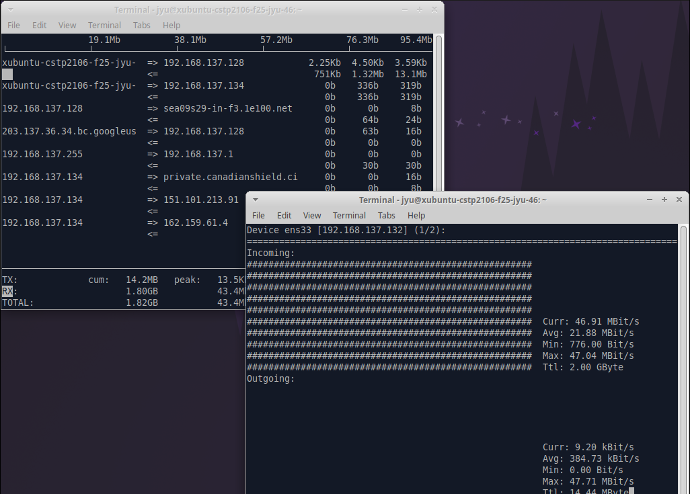

# DDoS Attack Lab

**Setup Requirements**

Make three VMs, an attacker, a victim and an observer

## Part 1 – Install Monitoring Tools

On the victim VM, set VM bandwidth to ```45M bps```, and install some tools

**For simulate webserver**

use apach2 to create a webserver
```
sudo apt install apache2
sudo systemctl enable apach2
sudo systemctl start apach2
```

**For monitoring DDoS attack**

use iftop to monitor network inflow and outflow traffic
```
sudo apt install iftop nload iptraf-ng
```

## Part 2 – Attacking

On the attacker VM, make a folder called ```ddos```, and create a python file ddos-attack.py in it, copy attack code to py file.


## Part 3 - Start Monitoring

On the victim VM, create two terminal window, first window run:

```
sudo iftop -i <your network interface>
```

Second window run:

```
sudo nload -i <your network interface>
```

On the attacker VM, run ddos-attack.py:

```
python2 ddos-attack.py
```

Fill victim's IP and port number: 80

Start ddos attack:



Before ddos attack:



After ddos attack:



## Part 4 - Defense DDoS

**Firewall defense (nftables)**

Modify ```/etc/nftables.conf```, copy the rule code in it:

```
sudo nano /etc/nftables.conf
```

Start nftables to enable the firewall:

``` 
sudo systemctl enable nftables
sudo systemctl start nftables
```

After enable the firewall, the attacker VM cannot open the victim's website.



**XDP defense**


```
sudo apt-get install clang llvm libbpf-dev make -y
```

Make a folder called xdp, copy ```xdp_ddos_protection.c``` and ```Makefile``` in it, and run: 

```
make compile
```

If get compile error, run: 

```
sudo ln -s /usr/include/x86_64-linux-gnu/asm /usr/include/asm
```

Start defense:

```
make attach IFACE=<your network interface>
```

After start xdp defense, the ddos packets cannot be ```iftop``` received.



